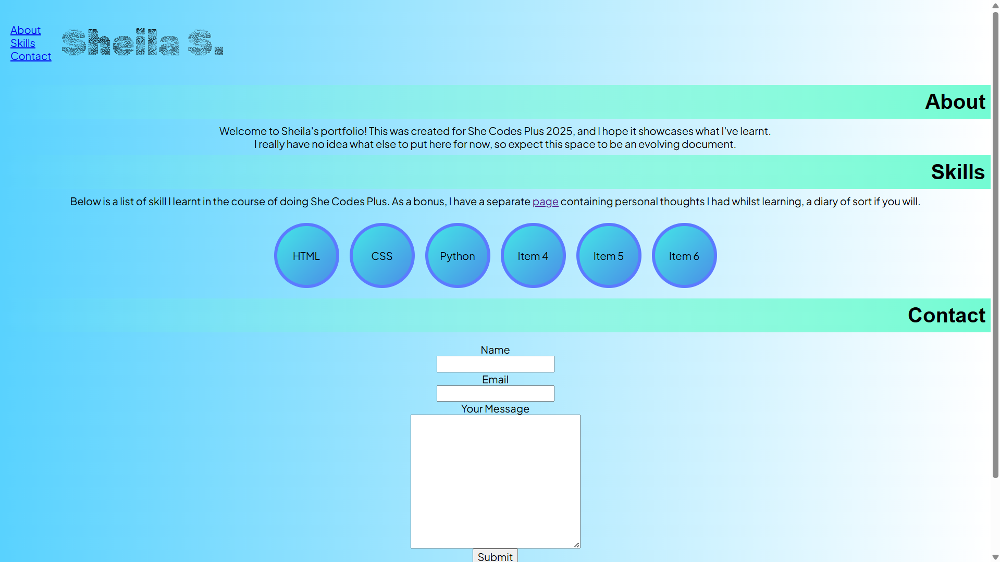
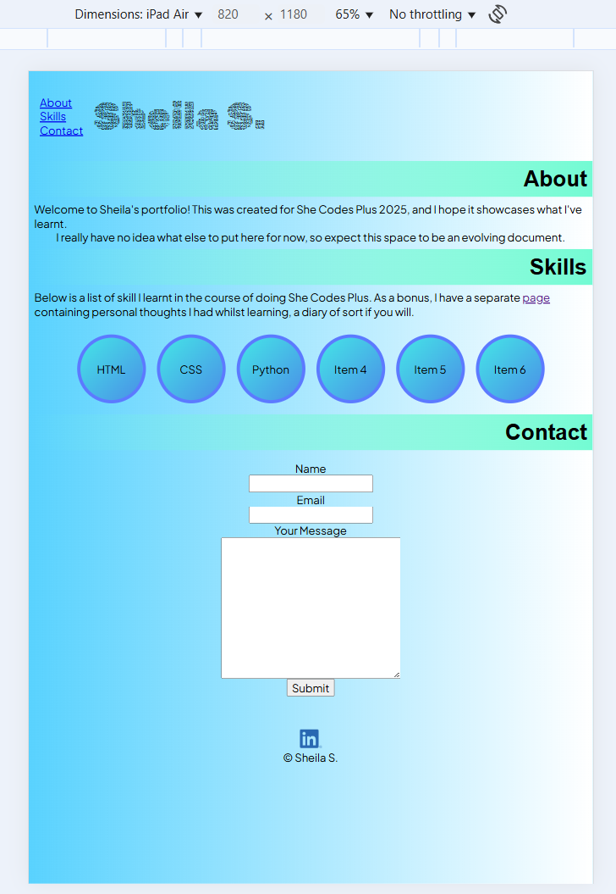
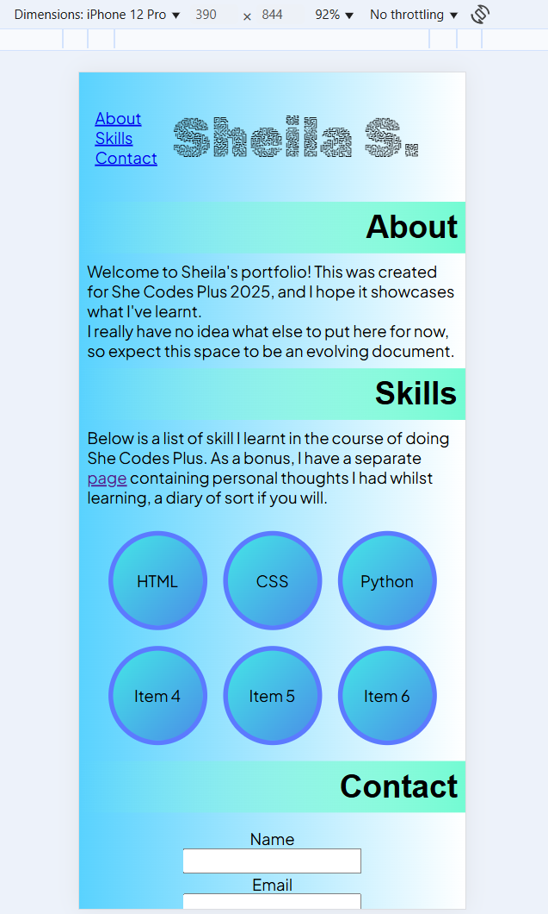

# 
#  Sheila S. - Portfolio Task
​
[My portfolio site](https://gudetamago.github.io/)
​
## Project Requirements

### Content
 Add a short paragraph describing the features below. What aesthetic and technical choices did you make? 
- [x] At least one profile picture - added a sketch representation of myself
- [?] Biography (at least 100 words) - I struggled with this and added only a brief text
- [x] Functional Contact Form - tested and works
- [?] "Projects" section - instead of Projects I went with "Skills", with the intention to expand with more information in the future relating to level of competency for each 
- [x] Links to external sites, e.g. GitHub and LinkedIn. - LinkedIn link added
​
### Technical
 Add a short paragraph describing the features below. What strategies or design decisions did you work from? 
- [x] At least 2 web pages. - the 2nd page is a bit of an Easter egg
- [x] Version controlled with Git
- [x] Deployed on GitHub pages.
- [x] Implements responsive design principles. - Whilst there's CSS for media, it doesn't do much as the site itself had a simple design to begin with
- [x] Uses semantic HTML.

### Bonus (optional)
 Add a short paragraph describing the features below, if you included any. 
- [ ] Different styles for active, hover and focus states. - I added tooltip, but I don't believe it qualifies for this
- [ ] Include JavaScript to add some dynamic elements to your site. (Extra tricky!) - not done
​
### Screenshots
> Please include the following:
> - The different pages and features of your website on mobile, tablet and desktop screen sizes (multiple screenshots per page and screen size).
> - The different features of your site, e.g. if you have hover states, take a screenshot that shows that.  
> 
> You can do this by saving the images in a folder in your repo, and including them in your readme document with the following Markdown code: 

####  Portfolio site on Desktop 

####  Portfolio site on iPad Air 

####  Portfolio site on iPhone 12 Pro
